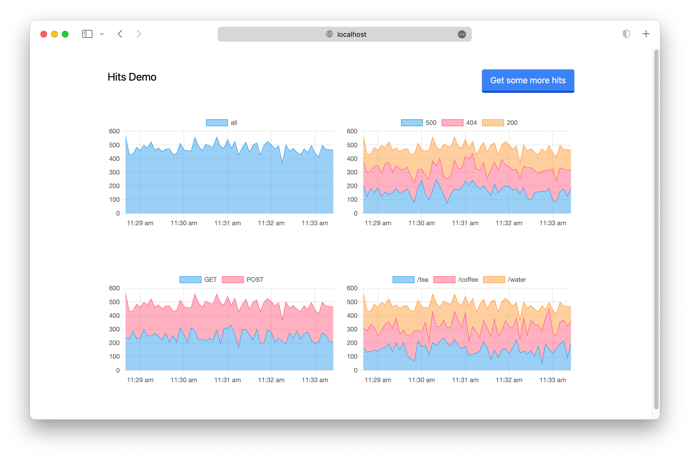

# djaclick

An example of using [ClickHouse] timeseries data in a [Django] application.

Why this? Because:

- I didn't know Django and I thought it'd be nice to learn to use it.
- I liked the idea of pulling data from ClickHouse and graphing it because I've
  enjoyed playing with ClickHouse and metrics in [other settings recently].

The repository contains a few things:

1. A Go application to create dummy data, and a [Vector] configuration file that
   will accept that data on `stdin` and push it to a local ClickHouse.
2. A Django application using `chart.js` and `tailwindcss` that displays a 5s
   aggregation of the count of the data records in ClickHouse.

It's designed to show several things acting in concert: data generation, ingest,
ClickHouse in action (very shallowly) and Django (also shallowly).



To get it running we must:

- Install ClickHouse and create the expected `hits` table structure.
- Install Vector, and run the Go app to push data into ClickHouse.
- Set up the Django application and run it.

[Django]: https://www.djangoproject.com/
[ClickHouse]: https://clickhouse.com/
[Vector]: https://vector.dev/
[other settings recently]: https://dx13.co.uk/articles/2023/08/29/journal/

## Clickhouse

- Install ClickHouse using
  [these instructions](https://clickhouse.com/#getting_started).

- Start the server:

  ```
  ./clickhouse server
  ```

- Start the client:

  ```
  ./clickhouse client
  ```

- And create the table for the data:

  ```
  CREATE TABLE hits
  (
      `ts` DateTime,
      `status` LowCardinality(String),
      `method` LowCardinality(String),
      `path` String
  )
  ENGINE = MergeTree
  ORDER BY ts
  ```

## Inserting ClickHouse data

The data is generated via Go and inserted via Vector.

```
brew tap vectordotdev/brew && brew install vector
go build main.go | vector --config vector.toml
```

(Why Go and Vector rather than Python writing direct? I find Go's `Ticker` great
for these kinds of periodic-work apps. Vector allowed me to avoid going deep on
Go by leveraging its built-in ClickHouse sink --- meaning my Go can be std lib
only, so trivial to run like a script. That's valuable for this kind of hack.)

## The Django app

- Install Python and Nodejs, the versions I used were:

  ```
  asdf install python 3.10.13
  asdf install nodejs 18.19.0
  ```

- Clone:

  ```
  git clone git@github.com:mikerhodes/djaclick.git
  cd djaclick
  ```

- After cloning this repository, in the repository:

  ```
  python -m venv venv
  source ./venv/bin/activate.fish
  pip install -r requirements.txt
  ```

- One thing that the avove `pip` run installed was a Django tailwind plugin. It
  needs initialising. The Django application has all the relevant settings, just
  the `init`, `install` and `start` need to be run, specifically:

  ```
  cd djaclick
  python manage.py tailwind init
  python manage.py tailwind install
  python manage.py tailwind start
  ```

  Use `theme` as the name. It should set up the `theme` directory.

  These are taken from
  [Installation — Django-Tailwind 2.0.0 documentation](https://django-tailwind.readthedocs.io/en/latest/installation.html).
  The app configuration should all be set up correctly already, so those steps
  are not needed.

  (Tailwind feels a bit overkill frankly, but I only learned that later).

- Try running the server:

  ```
  cd djaclick
  python manage.py runserver
  ```

- Open [Hits Demo](http://localhost:8000/hits/).

## Chart.js

Some references:

- [Time Cartesian Axis | Chart.js](https://www.chartjs.org/docs/latest/axes/cartesian/time.html)

## Clickhouse and Python

Some references:

- [A Python client working example for connecting to ClickHouse Cloud Service | ClickHouse Docs](https://clickhouse.com/docs/knowledgebase/python-clickhouse-connect-example)
